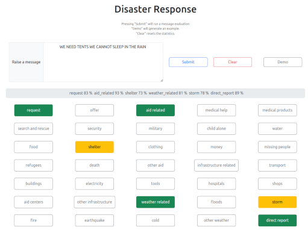

# Disaster response analysis helper

This is a demo app that analyses arbitrary text messages whether they are relevant for disaster protection and puts it with the help of AI into relevant categories (like 'missing people', 'child alone' or 'food') for a quicker processing of a human operator.

## How to run

Running from scratch one needs to 

0. Create virtual environment (use `requirements.txt` for package list)

1. Compose the dataset by `python pipelines/etl.py`
2. Compose the classifier `python pipelines/ml.py`
3. Run the interface `python web_interface.py` and follow the instructions on the console output

As a shortcut, 1. and 2. can be skipped when `ressources/classifier.pkl` exists.

## Structure

This program needs an offline preparation before actual usage. This is covered in the `pipelines` directory, where 

- `etl.py` extracts data and composes a dataset
- `ml.py` utilizes that dataset for preparing and training classifiers

Further files are for maintaining the UI

- `web_interface.py` and `UI.py` for running the `Flask` environment
- `analyzer.py` as used as an helper interface for the classifier

## Copyright and license

Code and documentation copyright 2024 the Frank Alexander Ihle. Code released under the MIT License. Docs released under Creative Commons.